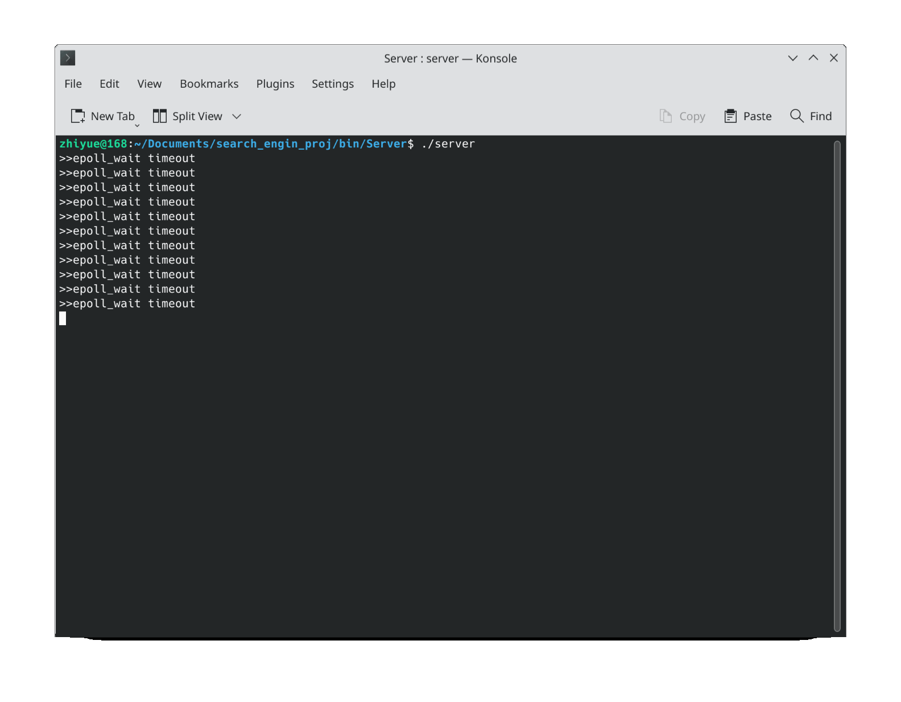

[English](https://github.com/dropsong/search-engine-toy/blob/master/readme_English.md)

# 使用方法

安装 redis 。

在 bin/Server 下运行 server 。

在另一终端下 ``nc 127.0.0.1 8888`` 即可连接 server 。

client 端的查询格式：
- 关键字推荐： ``1 yourInputWord``
- 网页查询： ``2 yourSearchWord``

# 简要介绍

本项目完成了一个非常简易的搜索引擎。



要点：
- 中英文混合搜索
- 服务器采用 Reactor 模型
- 使用 redis 缓存
- simhash 网页去重
- 使用最小编辑距离算法推荐关键词
- 使用 TF-IDF 算法计算权重系数
- ...

# 如何添加语料

可以删除 data 下的数据，使用自己的数据。

安装 boost::regex :

```
sudo apt-get install libboost-regex-dev
```

安装 hiredis :

```
git clone https://github.com/redis/hiredis.git
tar -xzvf hiredis.tar.gz
cd hiredis
make
sudo make install
sudo ldconfig
```

## 关键字推荐部分

加点现代的文本，不要加三国演义之类的东西，不然画风会比较猎奇。

### 英文

可在 data/en_wordReco_rawData 下自行添加语料。

文件名不要以“0”或“1”开头，因为脚本的逻辑依赖这个。

添加后执行脚本 run_enWordFreq.sh 

然后执行脚本 run_enWordFreq_mergeDict.sh 以合并词频库。

合并词频库后需要 run_enIndexTable.sh 重新生成索引库。

### 中文

可在 data/zh_wordReco_rawData 下自行添加语料。

文件名不要以“0”开头。

添加后执行脚本 run_zhWordFreq.sh

然后执行脚本 run_zhWordFreq_mergeDict.sh 以合并词频库。

合并词频库后需要 run_zhIndexTable.sh 重新生成索引库。

## 网页库部分

暂不支持增量添加（以后可能会做），可在 data/web_rawData_xmls 下添加 xml 文件。

然后在 bin/PageStuff 下执行脚本 gen_pagelib.sh 生成去重后的网页库。

在 bin/ 下执行脚本 run_gen_offset.sh 生成网页偏移库。

在 bin/InvertIndexTable/ 下执行脚本 gen_invertIndexTable.sh 生成倒排索引库。

# 第三方代码

直接使用源码，不需要额外部署：
- [cppjieba](https://github.com/yanyiwu/cppjieba) 
- [simhash](https://github.com/yanyiwu/simhash)
- [tinyxml2](https://github.com/leethomason/tinyxml2)

