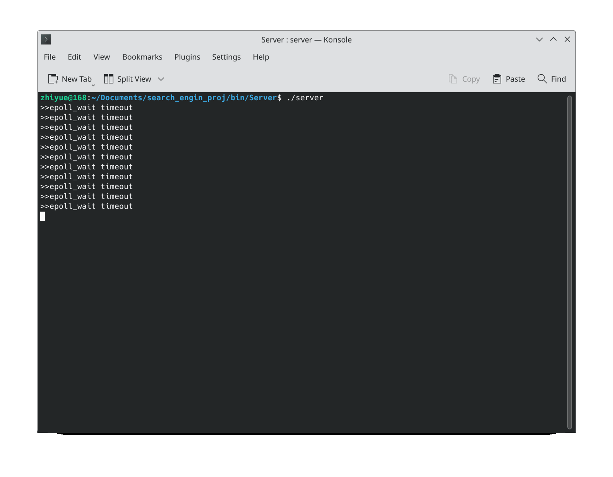

# Usage

Install redis.

Run ``server`` in bin/Server/ .

In another terminal, ``nc 127.0.0.1 8888`` can connect to the server.

Query format on the client side:

- Keyword recommendation: ``1 yourInputWord``

- Web page query: ``2 yourSearchWord``

# Brief introduction

This project has completed a very simple search engine.



Key points:

- Chinese and English mixed search

- The server uses the Reactor model

- Use redis cache

- Simhash web page deduplication
- Use the minimum edit distance algorithm to recommend keywords

- Use the TF-IDF algorithm to calculate the weight coefficient

# How to add corpus

You can delete the data under data/ and use your own data.

Install boost::regex:

```
sudo apt-get install libboost-regex-dev
```
Install hiredis:

```
git clone https://github.com/redis/hiredis.git
tar -xzvf hiredis.tar.gz
cd hiredis
make
sudo make install
sudo ldconfig
```

## Keyword recommendation section

Add some modern text, don't add things like Romance of the Three Kingdoms, otherwise the style will be more bizarre.

### English

You can add corpus by yourself under data/en_wordReco_rawData/  .

The file name should not start with "0" or "1" because the logic of the script depends on this.

After adding, execute the script ``run_enWordFreq.sh``

Then execute the script ``run_enWordFreq_mergeDict.sh`` to merge the word frequency library.

After merging the word frequency library, you need to ``run_enIndexTable.sh`` to regenerate the index library.

### Chinese

You can add corpus by yourself under data/zh_wordReco_rawData/  .

The file name should not start with "0".

After adding, execute the script ``run_zhWordFreq.sh``

Then execute the script ``run_zhWordFreq_mergeDict.sh`` to merge the word frequency library.

After merging the word frequency library, you need to ``run_zhIndexTable.sh`` to regenerate the index library.

## Web page library part

Incremental addition is not supported yet (it may be done in the future), you can add xml files under data/web_rawData_xmls/  .

Then execute the script ``gen_pagelib.sh`` under bin/PageStuff/ to generate the deduplicated web page library.

Execute the script ``run_gen_offset.sh`` under bin/ to generate the web page offset library.

Execute the script ``gen_invertIndexTable.sh`` in bin/InvertIndexTable/ to generate the inverted index library.

# Third-party code

This project use the source code directly, no additional deployment is required:
- [cppjieba](https://github.com/yanyiwu/cppjieba)
- [simhash](https://github.com/yanyiwu/simhash)
- [tinyxml2](https://github.com/leethomason/tinyxml2)
